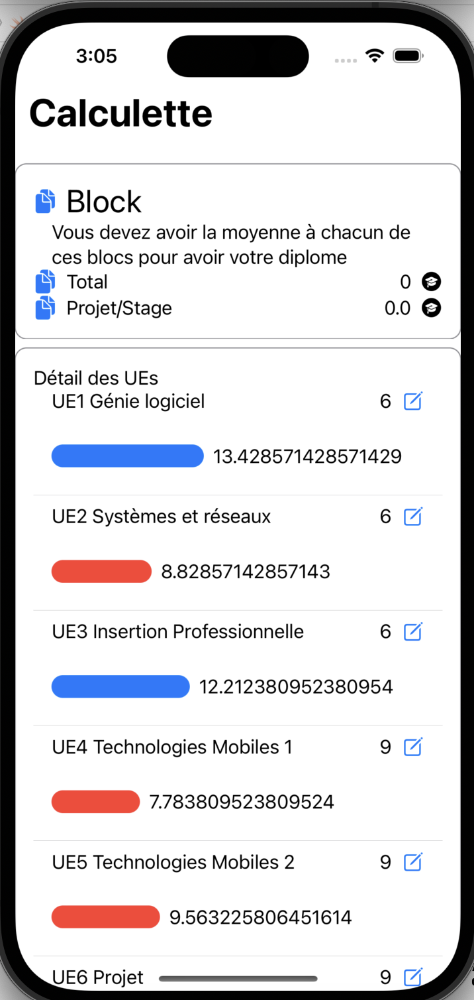

# Calculatrice Application
Une application dédiée à la simulation et au calcul de moyennes.

# Captures d'écrans de la vue
| Résumé des notes | Notes de l'UE | Modification | Modification | Suppression |
| :---: | :---: | :---: | :---: | :---: |
|||||||

# Fonctionnalités

L'application offre les fonctionnalités suivantes :

1. **Consultation des Notes :** Les utilisateurs peuvent accéder en lecture aux notes attribuées aux Blocs et aux Unités d'Enseignement (UE), mais ils ne peuvent pas les modifier.

2. **Détails des UE :** En cliquant sur l'image associée à une UE, les utilisateurs peuvent accéder aux détails de cette UE et passer à la page suivante pour obtenir plus d'informations.

3. **Gestion des Notes d'UE :** Les utilisateurs ont la possibilité de consulter les notes attribuées à une UE. Ils peuvent également passer en mode édition de la note en cliquant sur le cadenas. En mode édition, ils peuvent effectuer les actions suivantes :
   - Modifier le coefficient de l'UE.
   - Modifier la description de l'UE.
   - Ajouter de nouvelles Matières.
   - Supprimer des Matières.
   - Modifier des Matières.
   - Changer le nom de l'UE.
   - Changer le coefficient de l'UE.

4. **Indicateurs de Performance :** En mode édition de la note d'UE, une capsule est affichée à côté de la note. Si la note est inférieure à 10, la capsule est rouge, indiquant une performance insuffisante. Si la note est égale ou supérieure à 10, la capsule est verte, signifiant une performance satisfaisante.

Ces fonctionnalités offrent aux utilisateurs une expérience complète de gestion et de consultation des notes et des détails des Unités d'Enseignement (UE) dans l'application.

## Auteur

Najlae LAMBARAA
