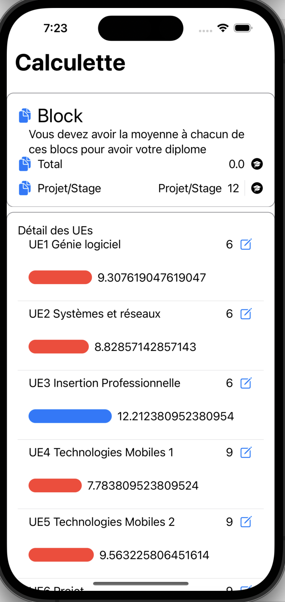

# Captures d'écrans de la vue

## Le travail rendu

- Ajouter des Matières
- Enlever des Matières
- Modifier des Matières
- Changer le nom
- Changer le coefficient
- la moyenne des Matières
- Total de projet/stage
